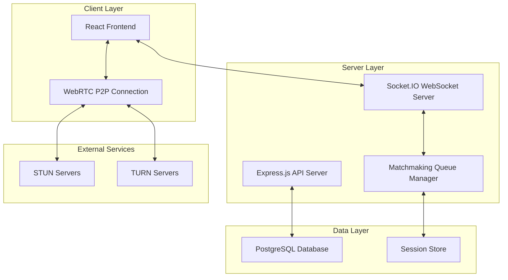

# Design Document

## Overview

The Random-chat is architected as a full-stack real-time application with a React frontend, Node.js backend, and PostgreSQL database. The system uses WebSocket connections for signaling and matchmaking, while leveraging WebRTC for peer-to-peer media communication. The architecture emphasizes minimal data storage, instant connectivity, and scalable real-time communication.

## Architecture

### High-Level Architecture



### Technology Stack

**Frontend:**
- React 18 with Vite for fast development and building
- Tailwind CSS for responsive styling
- Socket.IO Client for WebSocket communication
- WebRTC APIs for peer-to-peer media

**Backend:**
- Node.js with Express.js for HTTP API
- Socket.IO for WebSocket signaling server
- PostgreSQL with pg library for data persistence
- CORS and helmet for security

**Infrastructure:**
- Frontend: Vercel or Firebase Hosting
- Backend: Google Cloud Run or Render
- Database: Supabase or Neon PostgreSQL
- STUN/TURN: Google STUN servers + optional coturn

## Components and Interfaces

### Frontend Components

#### 1. App Component
- **Purpose:** Root component managing global state and routing
- **State:** Current screen (landing, waiting, chatting), user session
- **Props:** None (root component)

#### 2. LandingScreen Component
- **Purpose:** Initial screen for mode selection and disclaimer
- **State:** Selected chat mode, terms acceptance
- **Events:** onStartChat(mode), onTermsAccept()

#### 3. WaitingScreen Component
- **Purpose:** Displays matching progress and queue status
- **State:** Matching status, estimated wait time
- **Events:** onCancelSearch()

#### 4. ChatScreen Component
- **Purpose:** Main chat interface for both text and video modes
- **State:** Messages, connection status, peer info
- **Events:** onSendMessage(), onNext(), onReport(), onEndChat()

#### 5. VideoChat Component
- **Purpose:** Video-specific UI with media controls
- **State:** Local/remote streams, mute status, video enabled
- **Events:** onToggleMute(), onToggleVideo(), onFullscreen()

#### 6. TextChat Component
- **Purpose:** Text-only chat interface
- **State:** Message history, typing indicators
- **Events:** onSendMessage(), onTyping()

### Backend Services

#### 1. WebSocket Signaling Service
```javascript
class SignalingService {
  handleConnection(socket)
  handleDisconnection(socket)
  handleJoinQueue(socket, mode)
  handleLeaveQueue(socket)
  handleWebRTCSignaling(socket, data)
  handleChatMessage(socket, message)
}
```

#### 2. Matchmaking Service
```javascript
class MatchmakingService {
  addToQueue(userId, mode, socket)
  removeFromQueue(userId)
  findMatch(mode)
  createMatch(user1, user2)
  handleMatchDisconnection(matchId, userId)
}
```

#### 3. Session Service
```javascript
class SessionService {
  createSession(user1Id, user2Id, mode)
  updateSession(sessionId, data)
  endSession(sessionId)
  getActiveSessionsCount()
}
```

#### 4. Report Service
```javascript
class ReportService {
  createReport(sessionId, reporterId, reason)
  getReports(filters)
  getReportStats()
}
```

### API Endpoints

#### REST API
- `GET /api/health` - Health check
- `POST /api/report` - Submit report
- `GET /api/stats` - Public statistics
- `GET /admin/sessions` - Active sessions (protected)
- `GET /admin/reports` - Reports dashboard (protected)

#### WebSocket Events
- `join-queue` - Join matchmaking queue
- `leave-queue` - Leave matchmaking queue
- `match-found` - Notify users of successful match
- `webrtc-offer` - WebRTC offer signaling
- `webrtc-answer` - WebRTC answer signaling
- `webrtc-ice-candidate` - ICE candidate exchange
- `chat-message` - Text message in chat
- `user-disconnected` - Peer disconnection notification

## Data Models

### Database Schema

#### Sessions Table
```sql
CREATE TABLE sessions (
  id UUID PRIMARY KEY DEFAULT gen_random_uuid(),
  user1_id VARCHAR(255) NOT NULL,
  user2_id VARCHAR(255) NOT NULL,
  mode VARCHAR(20) NOT NULL CHECK (mode IN ('text', 'video')),
  started_at TIMESTAMP DEFAULT CURRENT_TIMESTAMP,
  ended_at TIMESTAMP,
  status VARCHAR(20) DEFAULT 'active' CHECK (status IN ('active', 'ended'))
);
```

#### Reports Table
```sql
CREATE TABLE reports (
  id UUID PRIMARY KEY DEFAULT gen_random_uuid(),
  session_id UUID REFERENCES sessions(id),
  reporter_id VARCHAR(255) NOT NULL,
  reported_at TIMESTAMP DEFAULT CURRENT_TIMESTAMP,
  reason VARCHAR(500),
  metadata JSONB
);
```

#### Indexes
```sql
CREATE INDEX idx_sessions_status ON sessions(status);
CREATE INDEX idx_sessions_started_at ON sessions(started_at);
CREATE INDEX idx_reports_session_id ON reports(session_id);
CREATE INDEX idx_reports_reported_at ON reports(reported_at);
```

### In-Memory Data Structures

#### Queue Management
```javascript
const queues = {
  text: new Set(), // Set of {userId, socketId, joinedAt}
  video: new Set()
};

const activeMatches = new Map(); // matchId -> {user1, user2, mode, startedAt}
const userSessions = new Map(); // userId -> {matchId, partnerId, mode}
```

## Error Handling

### Frontend Error Handling

#### WebRTC Connection Errors
- **ICE Connection Failed:** Retry with TURN servers
- **Media Access Denied:** Show permission request dialog
- **Peer Connection Lost:** Attempt reconnection, fallback to queue

#### WebSocket Connection Errors
- **Connection Lost:** Implement exponential backoff reconnection
- **Server Unavailable:** Show maintenance message
- **Authentication Failed:** Redirect to landing page

### Backend Error Handling

#### Database Errors
- **Connection Pool Exhausted:** Queue requests with timeout
- **Query Timeout:** Log error, return 503 status
- **Constraint Violations:** Return 400 with specific error message

#### WebSocket Errors
- **Invalid Message Format:** Log and ignore malformed messages
- **Rate Limiting:** Implement per-socket message rate limits
- **Memory Leaks:** Clean up disconnected socket references

### Error Response Format
```javascript
{
  error: {
    code: "MATCH_NOT_FOUND",
    message: "No available users for matching",
    timestamp: "2024-01-15T10:30:00Z",
    requestId: "req_123456"
  }
}
```

## Testing Strategy

### Frontend Testing

#### Unit Tests (Jest + React Testing Library)
- Component rendering and props handling
- State management and hooks
- WebRTC utility functions
- Socket.IO event handlers

#### Integration Tests
- Complete user flows (join → match → chat → next)
- WebRTC connection establishment
- Socket.IO communication patterns
- Responsive design across devices

#### E2E Tests (Playwright)
- Full application workflows
- Cross-browser compatibility
- Mobile device testing
- Network condition simulation

### Backend Testing

#### Unit Tests (Jest)
- Service layer business logic
- Database query functions
- WebSocket event handlers
- Matchmaking algorithms

#### Integration Tests
- API endpoint functionality
- Database operations
- Socket.IO server behavior
- Queue management operations

#### Load Testing (Artillery.js)
- Concurrent user connections
- WebSocket message throughput
- Database performance under load
- Memory usage patterns

### Testing Data

#### Mock Data Generation
```javascript
const mockSession = {
  id: 'session_123',
  user1_id: 'user_456',
  user2_id: 'user_789',
  mode: 'video',
  started_at: new Date().toISOString()
};

const mockWebRTCOffer = {
  type: 'offer',
  sdp: 'v=0\r\no=- 123456789 2 IN IP4 127.0.0.1\r\n...'
};
```

### Performance Monitoring

#### Metrics to Track
- WebSocket connection count and duration
- WebRTC connection success rate
- Average matchmaking time
- Database query performance
- Memory usage and garbage collection

#### Monitoring Tools
- Application Performance Monitoring (APM)
- Database query analysis
- Real-time connection dashboards
- Error rate and latency tracking

## Security Considerations

### Data Privacy
- No persistent user data storage
- Session IDs are temporary and non-identifying
- Chat content is never stored server-side
- Reports contain minimal metadata only

### Connection Security
- HTTPS/WSS encryption for all communications
- WebRTC DTLS encryption for peer-to-peer media
- CORS configuration for API access
- Rate limiting on WebSocket connections

### Input Validation
- Sanitize all user inputs
- Validate WebRTC signaling data
- Limit message size and frequency
- Prevent XSS in chat messages

### Infrastructure Security
- Environment variable management
- Database connection encryption
- API authentication for admin routes
- Regular security dependency updates